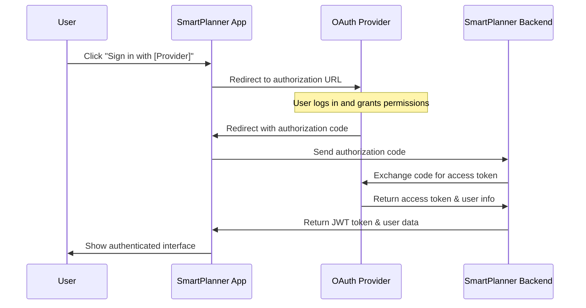
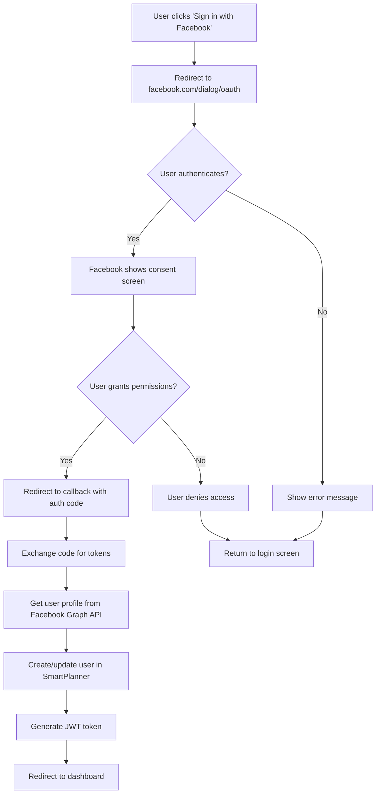
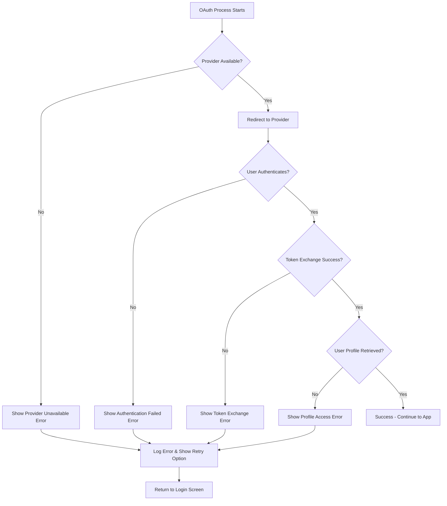
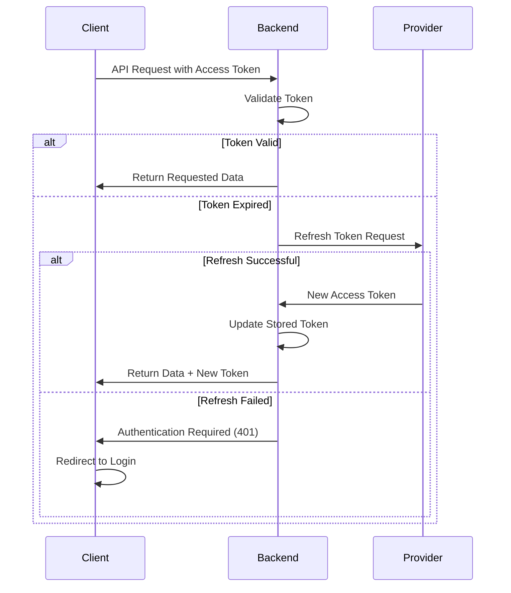
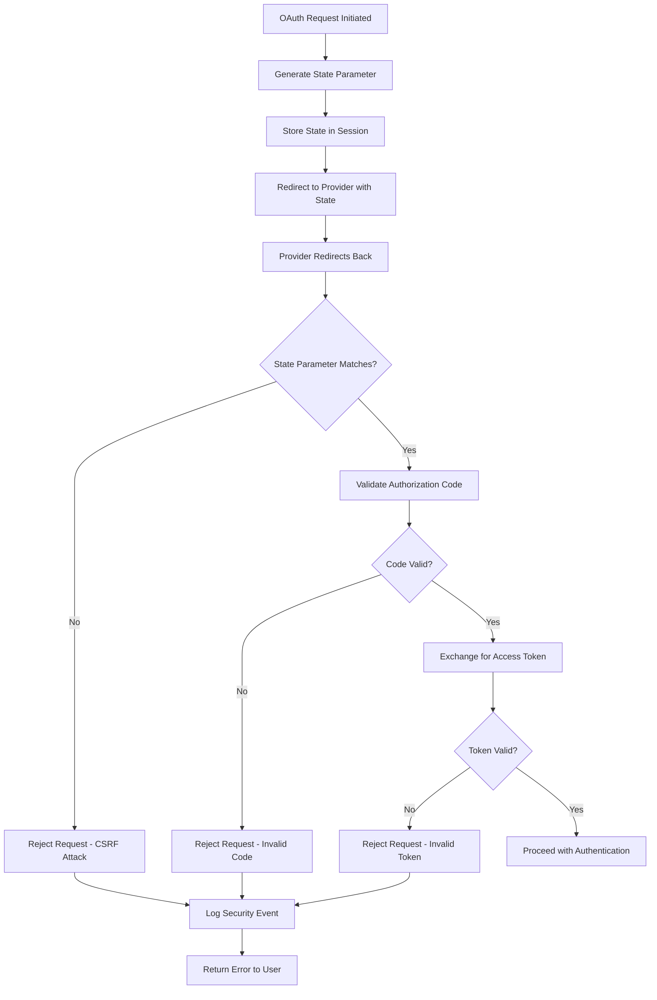
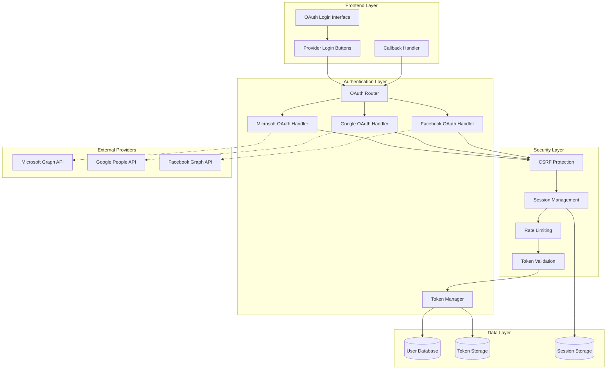

# OAuth Authentication Flow Diagrams

## 🔄 **Complete OAuth Flow Overview**

### **Standard OAuth 2.0 Authorization Code Flow**

### **Microsoft OAuth Flow Details**

### **Google OAuth Flow Details**

### **Facebook OAuth Flow Details**

### **Error Handling Flow**

### **Token Refresh Flow**

### **Security Considerations Flow**

---

## 🔧 **Implementation Architecture**

### **SmartPlanner OAuth Architecture**

---

*These flow diagrams provide a comprehensive visual understanding of the OAuth authentication process in SmartPlanner, including security considerations and error handling patterns.*
