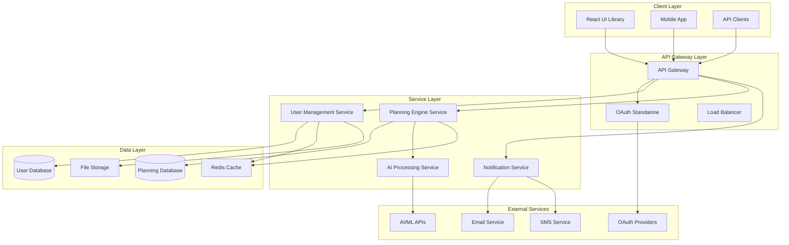
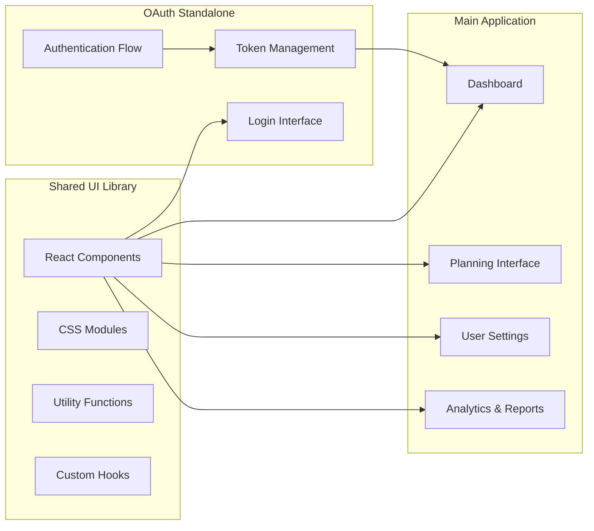
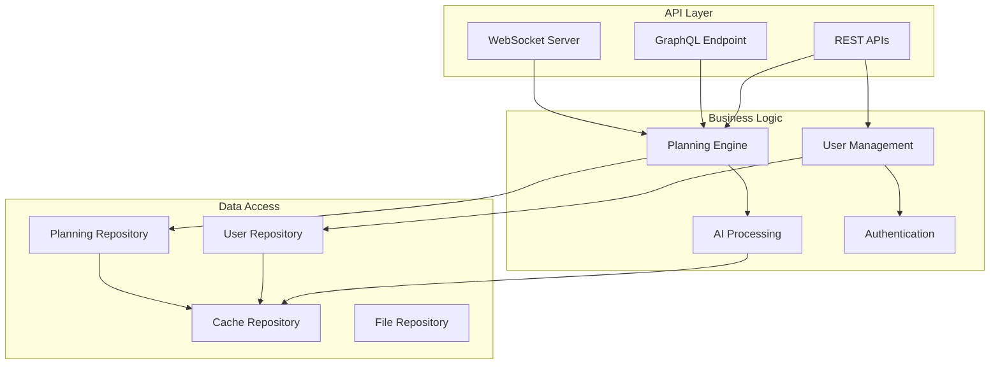
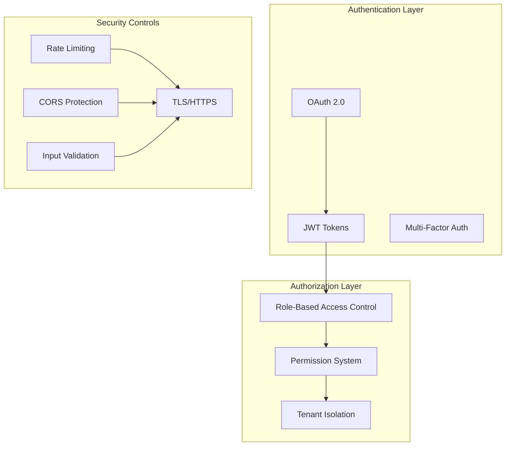
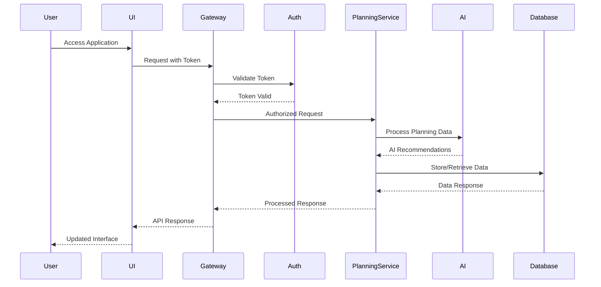
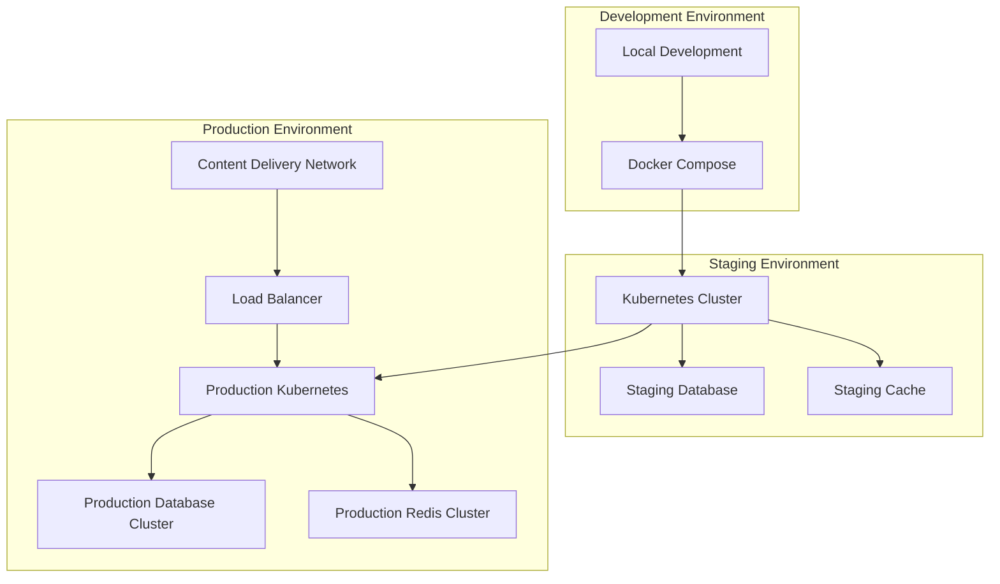

# 🏗️ SmartPlanner System Architecture

## 🎯 **System Overview**

SmartPlanner is a comprehensive AI-powered planning and productivity platform built with a modern, scalable microservices architecture. The system provides intelligent planning capabilities, user management, and OAuth authentication in a multi-tenant environment.

## 🏛️ **High-Level Architecture**

## 🔧 **Component Architecture**

### **Frontend Components**

### **Backend Services Architecture**

## 🔐 **Security Architecture**

## 📊 **Data Flow Architecture**

## 🛠️ **Technology Stack**

### **Frontend Technologies**
- **Framework**: React 18+ with TypeScript
- **Build Tool**: Vite for fast development and building
- **Styling**: CSS Modules with modern CSS features
- **State Management**: Context API with custom hooks
- **Testing**: Jest + React Testing Library
- **Accessibility**: WCAG 2.1 AA compliance

### **Backend Technologies**
- **Runtime**: Node.js with TypeScript
- **Framework**: Express.js or Fastify
- **Database**: PostgreSQL with Prisma ORM
- **Cache**: Redis for session and data caching
- **Authentication**: OAuth 2.0 with JWT tokens
- **API Documentation**: OpenAPI/Swagger

### **Infrastructure**
- **Containerization**: Docker with multi-stage builds
- **Orchestration**: Kubernetes or Docker Compose
- **CI/CD**: GitHub Actions
- **Monitoring**: Prometheus + Grafana
- **Logging**: ELK Stack (Elasticsearch, Logstash, Kibana)

## 🚀 **Deployment Architecture**

## 📈 **Scalability Considerations**

### **Horizontal Scaling**
- Stateless service design for easy horizontal scaling
- Database read replicas for read-heavy workloads
- Microservices architecture for independent scaling
- Container orchestration for automated scaling

### **Performance Optimization**
- Redis caching for frequently accessed data
- CDN for static asset delivery
- Database query optimization with indexing
- API response caching and compression

### **Monitoring and Observability**
- Real-time metrics collection and alerting
- Distributed tracing for request flow analysis
- Centralized logging for troubleshooting
- Performance monitoring and SLA tracking

## 🔄 **Integration Patterns**

### **External Service Integration**
- OAuth provider integration (Google, Microsoft, GitHub)
- AI/ML service integration for intelligent features
- Email and SMS service integration for notifications
- Third-party calendar and productivity tool integration

### **Internal Service Communication**
- REST APIs for synchronous communication
- Message queues for asynchronous processing
- Event-driven architecture for real-time updates
- GraphQL for flexible data querying

---

*This architecture is designed to support high availability, scalability, and maintainability while providing a superior user experience and robust security.*
