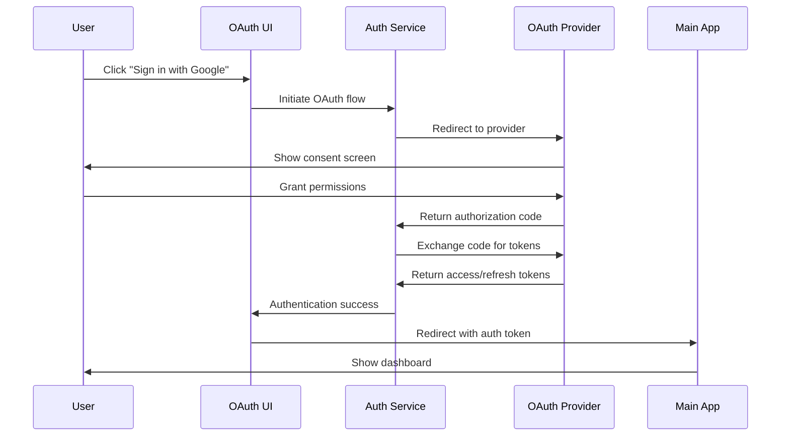
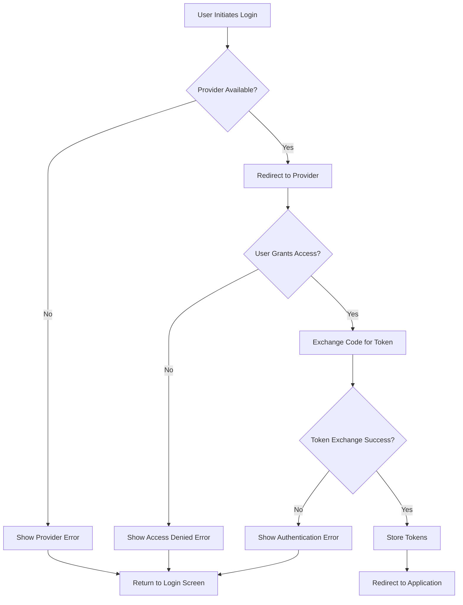
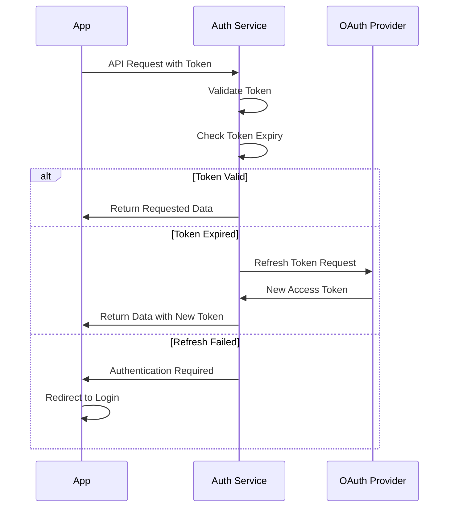
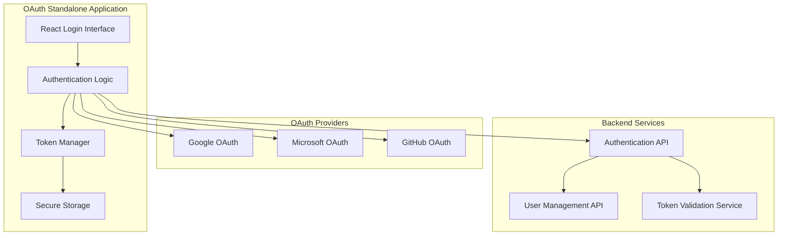

# 🔐 OAuth Authentication System

## 🎯 **Feature Overview**

The SmartPlanner OAuth Authentication System provides secure, multi-provider authentication with a standalone interface optimized for maximum usability and accessibility. The system supports major OAuth providers and implements industry-standard security practices.

## 👥 **User Stories**

### **Primary User Stories**

#### **US-001: User Login with OAuth Provider**
**As a** user  
**I want to** log in using my existing Google/Microsoft/GitHub account  
**So that** I can access SmartPlanner without creating a new password  

**Acceptance Criteria:**
- [ ] User can select from available OAuth providers (Google, Microsoft, GitHub)
- [ ] OAuth flow completes successfully with proper error handling
- [ ] User is redirected to the main application after successful authentication
- [ ] Failed authentication displays clear error messages
- [ ] Authentication state persists across browser sessions

#### **US-002: Visual Accessibility and Clarity**
**As a** user with visual impairments or using different devices  
**I want** clear, high-contrast text and intuitive interface elements  
**So that** I can easily navigate the authentication process  

**Acceptance Criteria:**
- [ ] Text meets WCAG AAA contrast standards (white text on black backgrounds)
- [ ] Interface is fully responsive across all device sizes
- [ ] Screen reader compatibility with proper ARIA labels
- [ ] Keyboard navigation support for all interactive elements
- [ ] Clear visual feedback for button states and interactions

#### **US-003: Security and Token Management**
**As a** system administrator  
**I want** secure token handling and session management  
**So that** user data and authentication state remain protected  

**Acceptance Criteria:**
- [ ] JWT tokens are properly generated and validated
- [ ] Secure storage of authentication tokens
- [ ] Automatic token refresh before expiration
- [ ] Proper logout and session cleanup
- [ ] Rate limiting to prevent authentication abuse

## 🔄 **Use Cases**

### **UC-001: Standard OAuth Login Flow**



### **UC-002: Authentication Error Handling**



### **UC-003: Token Refresh Flow**



## 🛠️ **Technical Specifications**

### **Architecture Components**



### **Security Implementation**

#### **Token Security**
- **JWT Structure**: Standard JWT with custom claims for user context
- **Token Expiry**: 1-hour access tokens, 30-day refresh tokens
- **Storage**: HttpOnly cookies for refresh tokens, memory for access tokens
- **Validation**: Signature verification with provider public keys

#### **CSRF Protection**
- State parameter validation in OAuth flow
- SameSite cookie attributes
- Origin header validation
- Request timing attack prevention

#### **Rate Limiting**
- 5 login attempts per minute per IP
- 100 OAuth redirects per hour per IP
- Token refresh limited to 1 per minute per user

### **Provider Configuration**

#### **Google OAuth**
```json
{
  "clientId": "{{GOOGLE_CLIENT_ID}}",
  "clientSecret": "{{GOOGLE_CLIENT_SECRET}}",
  "redirectUri": "{{BASE_URL}}/auth/google/callback",
  "scope": ["openid", "email", "profile"],
  "responseType": "code",
  "accessType": "offline"
}
```

#### **Microsoft OAuth**
```json
{
  "clientId": "{{MICROSOFT_CLIENT_ID}}",
  "clientSecret": "{{MICROSOFT_CLIENT_SECRET}}",
  "redirectUri": "{{BASE_URL}}/auth/microsoft/callback",
  "scope": ["openid", "email", "profile"],
  "responseType": "code",
  "prompt": "select_account"
}
```

#### **GitHub OAuth**
```json
{
  "clientId": "{{GITHUB_CLIENT_ID}}",
  "clientSecret": "{{GITHUB_CLIENT_SECRET}}",
  "redirectUri": "{{BASE_URL}}/auth/github/callback",
  "scope": ["user:email", "read:user"],
  "allowSignup": true
}
```

## 🎨 **User Interface Specifications**

### **Design System**

#### **Typography**
- **Primary Heading**: 3rem font size, 900 font weight, white color
- **Body Text**: 1rem font size, 400 font weight, white color
- **Button Text**: 1.1rem font size, 700 font weight, white color
- **Font Family**: System fonts with fallbacks

#### **Color Palette**
- **Background**: Pure black (#000000) for maximum contrast
- **Text**: Pure white (#ffffff) for optimal readability
- **Borders**: White (#ffffff) with 2-3px thickness
- **Buttons**: Dark gray (#333333) with white borders
- **Hover States**: Medium gray (#555555) for interactive feedback

#### **Spacing and Layout**
- **Container**: Maximum width 600px, centered layout
- **Padding**: 2rem for headings, 1rem for buttons
- **Margins**: 1rem between elements, 2rem for sections
- **Border Radius**: 12px for cards, 8px for buttons

### **Responsive Design**

#### **Desktop (1200px+)**
- Full-width login card with social buttons in grid layout
- Large heading text (3rem) with generous spacing
- Hover animations and transitions

#### **Tablet (768px - 1199px)**
- Medium-sized login card with adjusted padding
- Reduced heading text (2.5rem) for better fit
- Touch-friendly button sizes

#### **Mobile (320px - 767px)**
- Full-width login interface with minimal margins
- Smaller heading text (2rem) for mobile screens
- Stack social buttons vertically for better usability

### **Accessibility Features**

#### **WCAG AAA Compliance**
- Contrast ratio exceeds 7:1 for all text elements
- Focus indicators visible and clearly defined
- Alternative text for all images and icons
- Screen reader announcements for state changes

#### **Keyboard Navigation**
- Tab order follows logical flow through interface
- Enter key activates buttons and links
- Escape key cancels modal dialogs
- Arrow keys navigate through options where applicable

#### **Assistive Technology Support**
- ARIA labels for all interactive elements
- Role attributes for semantic structure
- Live regions for dynamic content updates
- High contrast mode detection and optimization

## 🧪 **Testing Specifications**

### **Unit Tests**
- [ ] OAuth provider configuration validation
- [ ] Token generation and validation logic
- [ ] Error handling for various failure scenarios
- [ ] UI component rendering and interaction

### **Integration Tests**
- [ ] Complete OAuth flow with each provider
- [ ] Token refresh and expiration handling
- [ ] Cross-browser compatibility testing
- [ ] Mobile device authentication testing

### **Security Tests**
- [ ] CSRF attack prevention validation
- [ ] Token tampering detection
- [ ] Rate limiting effectiveness
- [ ] Session hijacking prevention

### **Accessibility Tests**
- [ ] Screen reader navigation testing
- [ ] Keyboard-only navigation verification
- [ ] Color contrast measurement
- [ ] High contrast mode compatibility

## 📊 **Performance Requirements**

### **Load Time Targets**
- **Initial page load**: < 2 seconds
- **OAuth redirect**: < 1 second
- **Token validation**: < 500ms
- **Error page display**: < 1 second

### **Scalability Metrics**
- **Concurrent users**: 1,000+ simultaneous authentications
- **Peak load**: 10,000 authentication requests per hour
- **Availability**: 99.9% uptime SLA
- **Response time**: 95th percentile under 2 seconds

## 🔧 **Configuration Management**

### **Environment Variables**
```bash
# OAuth Provider Configuration
GOOGLE_CLIENT_ID=your_google_client_id
GOOGLE_CLIENT_SECRET=your_google_client_secret
MICROSOFT_CLIENT_ID=your_microsoft_client_id
MICROSOFT_CLIENT_SECRET=your_microsoft_client_secret
GITHUB_CLIENT_ID=your_github_client_id
GITHUB_CLIENT_SECRET=your_github_client_secret

# Application Configuration
BASE_URL=https://your-domain.com
JWT_SECRET=your_jwt_secret_key
SESSION_SECRET=your_session_secret
REDIS_URL=redis://localhost:6379

# Security Configuration
CSRF_SECRET=your_csrf_secret
RATE_LIMIT_WINDOW=3600000
RATE_LIMIT_MAX=100
```

### **Deployment Configuration**
- Docker containerization for consistent deployment
- Kubernetes manifests for production scaling
- Environment-specific configuration files
- Secure secrets management with Kubernetes secrets

---

*This OAuth authentication system provides a secure, accessible, and user-friendly authentication experience while maintaining the highest standards of security and performance.*
